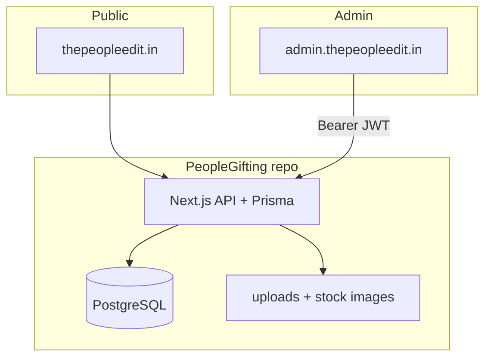

# Intern & new-hire onboarding — People Gifting

Welcome. This guide gets you productive on **The People Edit** without prior context.

## Day 0 — Access checklist

Ask your manager for:

- [ ] GitHub org invite to [`peoplegifting`](https://github.com/peoplegifting) (read on both private repos)
- [ ] Server / VPN access if you will deploy (optional for UI-only work)
- [ ] Copy of production-like `.env` values (never commit secrets)
- [ ] Admin login for local seed user (from website `ADMIN_EMAIL` / `ADMIN_PASSWORD`)

Clone:

```bash
git clone https://github.com/peoplegifting/PeopleGifting.git
git clone https://github.com/peoplegifting/PeopleGifting-Admin.git
```

## Mental model (5 minutes)



| Concept | Meaning |
|---------|---------|
| **PeopleGifting** | Website **and** API **and** DB migrations |
| **PeopleGifting-Admin** | UI only — calls the API |
| **Order** | An **enquiry** (`Inquiry` model), not a payment |
| **Gift list** | Client-side list that becomes enquiry line items |

## Day 1 — Run locally

### 1. Website + API

```bash
cd PeopleGifting
docker compose up -d
cp .env.example .env
# set NEXTAUTH_SECRET, ADMIN_EMAIL, ADMIN_PASSWORD
npm install
npx prisma migrate deploy
npm run db:seed
npm run dev
# http://localhost:3100
```

Health check: `curl http://localhost:3100/api/health`

### 2. Admin SPA

```bash
cd PeopleGifting-Admin
cp .env.example .env
# leave VITE_API_URL empty (Vite proxies /api → :3100)
npm install
npm run dev
# http://localhost:5174
```

Log in with the seeded admin credentials.

## First-week learning path

| Day | Focus | Where |
|-----|-------|-------|
| 1 | Run both apps; click through site + admin | Local |
| 2 | Read website README diagrams + Prisma schema | `PeopleGifting/README.md`, `prisma/schema.prisma` |
| 3 | Trace one enquiry: form → `POST /api/inquiries` → admin Orders | `src/app/enquire`, `src/app/api/inquiries` |
| 4 | Trace one product edit in admin → API → DB → public PDP | Admin Products + `/api/admin/products` |
| 5 | Read deploy docs (nginx, PM2, DNS) — shadow a deploy if possible | README + `deploy/` |

## Repo map

### PeopleGifting (website)

| Path | Purpose |
|------|---------|
| `src/app/` | Pages + App Router |
| `src/app/api/` | REST endpoints |
| `src/components/` | UI components |
| `src/lib/` | auth, prisma, mail, seo |
| `prisma/` | schema, migrations, seeds |
| `deploy/` | nginx templates |
| `uploads/` | runtime files (not in git) |

### PeopleGifting-Admin

| Path | Purpose |
|------|---------|
| `src/pages/` | Dashboard screens |
| `src/lib/api.ts` | API client + auth token |
| `src/components/` | Shared UI |
| `vite.config.ts` | Dev proxy to `:3100` |

## Rules that keep production safe

1. **Never commit `.env`** or real passwords.
2. Change code in a branch; open a PR; do not force-push `main`.
3. Admin CORS depends on `ADMIN_ORIGINS` on the API — include your local origin when testing.
4. After schema changes: create a Prisma migration; never edit old migrations that already ran in prod.
5. Rebuild admin with `VITE_API_URL=https://thepeopleedit.in` for production deploys.

## Useful commands

```bash
# Website
npm run dev
npm run build
npx prisma studio
pm2 logs thepeopleedit          # on server

# Admin
npm run dev
npm run build                   # outputs dist/
```

## Where to ask questions

| Topic | Look first |
|-------|------------|
| Architecture | Website README (Mermaid) |
| Admin modules / API table | Admin README |
| DNS / SSL | `PeopleGifting/DNS-INSTRUCTIONS.md` |
| Still stuck | Tag org admin on GitHub |

## Definition of done for your first PR

- [ ] Branch named `feat/...` or `fix/...`
- [ ] Works locally against seeded DB
- [ ] No secrets in the diff
- [ ] Short PR description: problem → change → how you tested
