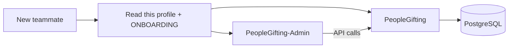

# People Gifting

**Premium corporate gifting** for [The People Edit](https://thepeopleedit.in) — production website, API, and admin CMS.

| | |
|---|---|
| **Live site** | https://thepeopleedit.in |
| **Admin** | https://admin.thepeopleedit.in |
| **Contact** | contact.thepeopleedit@gmail.com |
| **WhatsApp** | +91 9225302739 |
| **Instagram** | [@the_peopleedit](https://instagram.com/the_peopleedit) |

---

## Repositories

| Repository | What it is | Stack | Who works here |
|------------|------------|-------|----------------|
| **[PeopleGifting](https://github.com/peoplegifting/PeopleGifting)** | Public storefront + REST API + database (source of truth) | Next.js 15 · Prisma · PostgreSQL · Tailwind · PM2 · nginx | Backend + public UI |
| **[PeopleGifting-Admin](https://github.com/peoplegifting/PeopleGifting-Admin)** | Admin CMS (no backend of its own) | Vite · React 19 · React Router · Tailwind | Admin UI |

---

## Start here (new intern)

1. Read **[ONBOARDING.md](./profile/ONBOARDING.md)** in this repo (or open it from the org profile).
2. Clone both private repos and get local access from your manager.
3. Run the website API first, then the admin SPA.
4. Follow the first-week checklist in ONBOARDING.

---

## How the product works

- Visitors browse gifts on **thepeopleedit.in** and submit **enquiries** (no online checkout in v1).
- Admins manage catalogue, banners, FAQs, testimonials, and enquiry “orders” on **admin.thepeopleedit.in**.
- One PostgreSQL database lives with the website; the admin talks only through `/api/admin/*`.

---

## Production URLs & ports

| Service | URL / port |
|---------|------------|
| Website | https://thepeopleedit.in → Next.js `:3100` |
| Admin | https://admin.thepeopleedit.in → static `dist/` |
| Postgres | Docker host port `5434` |
| Admin local | `http://localhost:5174` |

---

## Collaboration & CI

See [COLLABORATION.md](../COLLABORATION.md) for invites, permissions, PRs, branch protection, and Actions.

## Support

Questions about access, `.env`, or deploy: ask the repo maintainer / org admin (`@harshalDharpure`).
